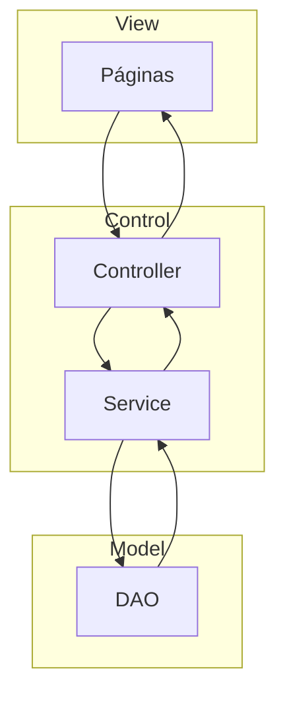

# Desafio Sinerji

Sistema desenvolvimdo para atender o desafio da Sinerji.

## Objetivo
Realizar operações de CRUD de uma pessoa com o seu respectivo endereço.

## Tecnologias
Foi utilizado o JSF, Primefaces, CDI, EJB, Maven, JUnit e Postgres.
 - JSF: Responsável pela criação das telas;
 - Primefaces: Responsável pela criação das telas e componentes customizáveis;
 - CDI: Gerenciador de injeção de dependência;
 - EJB: Gerenciamento de transação;
 - Maven: Gerenciamento de dependências;
 - Junit: Testes unitários;
 - Postgres: Banco de dados relacional;

## Arquitetura


## Preparando o ambiente

  1 - Faça o clone do projeto em uma pasta local de sua preferência:

```git clone https://github.com/rogeriomaia1/desafioSinerji.git``` <br/><br/>

  2 - Sugiro usar o **IDE Eclipse** disponível para download gratuito(https://www.eclipse.org/downloads/download.php?file=/oomph/epp/2024-03/R/eclipse-inst-jre-win64.exe).
  
  3 - Baixe Apache Tomcat 9 [https://tomcat.apache.org/download-80.cgi](https://tomcat.apache.org/download-90.cgi) e realize a configuração na IDE.
  
  4 - Baixe Java JDK 8, realize a configuração na IDE.
  
  5 - PostgreSQL 15 (https://www.postgresql.org/download/). Instale o compátível com o seu sistema operacional utilizando a configuração padrão de usuário.


## Construindo o projeto

  Como base irei seguir os passos para  a IDE Eclipse mas as demais são muito similares quanto ao processo.
  1 - Execute os script SQL disponível na raiz do projeto (*script.sql*)
  
  2 - Import o projeto como sendo um projeto maven;
  
  3 - Faça um update das dependências do maven;
  
  4 - Adicione o projeto a servidor Tomcat 9 e clique em Starter;

  5 - Para acessar utilize a url:
```http://localhost:8080/cadastrocliente/views/login.xhtml``` 

 <i><b>Obs: Nesse primeiro momento a tela de login só exige que os campos sejam preenchidos, posteriormente será implementado o mecanismo de controle de acesso.</b></i>
